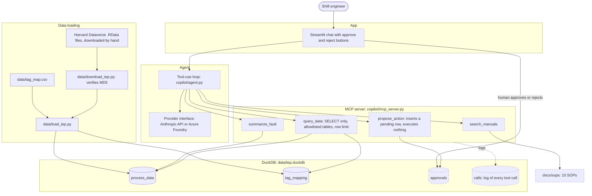

# Architecture

Solid boxes exist today. Dashed boxes are planned (see docs/plan.md).

```mermaid
flowchart TD
    engineer([Shift engineer])

    subgraph app_layer [App]
        chat[Streamlit chat with approve and reject buttons]
    end

    subgraph agent_layer [Agent]
        agent[Tool-use loop: copilot/agent.py]
        provider[Provider interface: Anthropic API or Azure Foundry]
    end

    subgraph mcp_layer [MCP server: copilot/mcp_server.py]
        search[search_manuals]
        query[query_data: SELECT only, allowlisted tables, row limit]
        summarize[summarize_fault]
        propose[propose_action: inserts a pending row, executes nothing]
    end

    subgraph store_layer [DuckDB: data/tep.duckdb]
        process[(process_data)]
        tags[(tag_mapping)]
        approvals[(approvals)]
        calls[(calls: log of every tool call)]
    end

    subgraph load_layer [Data loading]
        dataverse[Harvard Dataverse .RData files, downloaded by hand]
        download[data/download_tep.py: verifies MD5]
        tagmap[data/tag_map.csv]
        loader[data/load_tep.py]
    end

    sops[docs/sops: 10 SOPs]

    engineer --> chat
    chat --> agent
    agent --> provider
    agent --> search
    agent --> query
    agent --> summarize
    agent --> propose
    search --> sops
    query --> process
    query --> tags
    summarize --> process
    propose --> approvals
    chat -- human approves or rejects --> approvals
    mcp_layer -. logs .-> calls

    dataverse --> download
    download --> loader
    tagmap --> loader
    loader --> process
    loader --> tags

    classDef planned stroke-dasharray: 5 5
    class chat,agent,provider,search,query,summarize,propose,approvals,calls,sops planned
```
