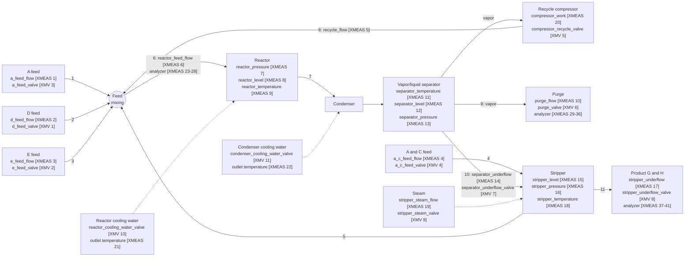

# TEP process flowsheet

Numbers on the arrows are stream numbers. Each box lists its column names in `process_data`,
with the original tag in brackets. The full mapping is in data/tag_map.csv.

```mermaid
flowchart LR
    A["A feed<br/>a_feed_flow [XMEAS 1]<br/>a_feed_valve [XMV 3]"]
    D["D feed<br/>d_feed_flow [XMEAS 2]<br/>d_feed_valve [XMV 1]"]
    E["E feed<br/>e_feed_flow [XMEAS 3]<br/>e_feed_valve [XMV 2]"]
    AC["A and C feed<br/>a_c_feed_flow [XMEAS 4]<br/>a_c_feed_valve [XMV 4]"]

    MIX(("Feed<br/>mixing"))
    REACTOR["Reactor<br/>reactor_pressure [XMEAS 7]<br/>reactor_level [XMEAS 8]<br/>reactor_temperature [XMEAS 9]"]
    RCW["Reactor cooling water<br/>reactor_cooling_water_valve [XMV 10]<br/>outlet temperature [XMEAS 21]"]
    COND["Condenser"]
    CCW["Condenser cooling water<br/>condenser_cooling_water_valve [XMV 11]<br/>outlet temperature [XMEAS 22]"]
    SEP["Vapor/liquid separator<br/>separator_temperature [XMEAS 11]<br/>separator_level [XMEAS 12]<br/>separator_pressure [XMEAS 13]"]
    COMP["Recycle compressor<br/>compressor_work [XMEAS 20]<br/>compressor_recycle_valve [XMV 5]"]
    PURGE["Purge<br/>purge_flow [XMEAS 10]<br/>purge_valve [XMV 6]<br/>analyzer [XMEAS 29-36]"]
    STRIP["Stripper<br/>stripper_level [XMEAS 15]<br/>stripper_pressure [XMEAS 16]<br/>stripper_temperature [XMEAS 18]"]
    STEAM["Steam<br/>stripper_steam_flow [XMEAS 19]<br/>stripper_steam_valve [XMV 9]"]
    PROD["Product G and H<br/>stripper_underflow [XMEAS 17]<br/>stripper_underflow_valve [XMV 8]<br/>analyzer [XMEAS 37-41]"]

    A -- 1 --> MIX
    D -- 2 --> MIX
    E -- 3 --> MIX
    AC -- 4 --> STRIP
    STRIP -- 5 --> MIX
    MIX -- "6: reactor_feed_flow [XMEAS 6]<br/>analyzer [XMEAS 23-28]" --> REACTOR
    REACTOR -- 7 --> COND
    COND --> SEP
    SEP -- vapor --> COMP
    COMP -- "8: recycle_flow [XMEAS 5]" --> MIX
    SEP -- "9: vapor" --> PURGE
    SEP -- "10: separator_underflow [XMEAS 14]<br/>separator_underflow_valve [XMV 7]" --> STRIP
    STRIP -- 11 --> PROD
    RCW -.-> REACTOR
    CCW -.-> COND
    STEAM -.-> STRIP
```
